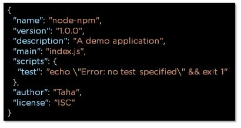
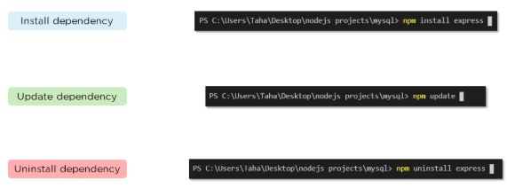
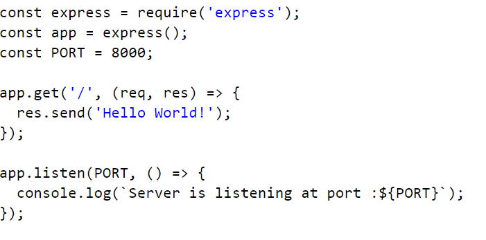

# NodeJS

### <span style="color:#0d6efd">What is node JS?</span>

---

**Node.js is an open-source, cross-platform JavaScript runtime environment
that executes JavaScript code outside of a browser.
Node.js is built on Chrome's V8 JavaScript engine.
Node.js is commonly used for developing server-side applications,
but it can also be used for developing desktop and mobile applications.**

---

### <span style="color:#0d6efd">What is NPM?</span>

---

**NPM stands for Node Package Manager, responsible for managing all the packages and modules for Node.js.
Node Package Manager provides two main functionalities
Provides online repositories for node.js packages/modules, which are searchable on search.nodejs.org
Provides command-line utility to install Node.js packages and also manages Node.js versions and dependencies**

---

### <span style="color:#0d6efd">What is the command used to import external libraries?</span>

---
**The “require” command is used for importing external libraries. For example - “var http=require (“HTTP”).”  This will load the HTTP library and the single exported object through the HTTP variable.
Now that we have covered some of the important beginner-level Node.js interview questions let us look at some of the intermediate-level Node.js interview questions.**

---

### <span style="color:#0d6efd">What is the package.json file?</span>

---
**The package.json file is the heart of a Node.js system. This file holds the metadata for a particular project. The package.json file is found in the root directory of any Node application or module
This is what a package.json file looks like immediately after creating a Node.js project using the command: npm init
You can edit the parameters when you create a Node.js project.**

[](./images/node-npm.jpeg)

---

### <span style="color:#0d6efd">How do you install, update, and delete a dependency?</span>

---
[](./images/npm-install.jpeg)

---

### <span style="color:#0d6efd"> How do you create a simple server in Node.js that returns Hello World?</span>

---
```javascript
var http = require('http');

http.createServer(function (req, res) {
  res.writeHead(200, {'Content-Type': 'text/html'});
  res.end('Hello World!');
}).listen(8080);

```
---

# Express


### <span style="color:#0d6efd">What is Express.Js?</span>

---
**Express is a small framework that sits on top of Node.js’s web server functionality to simplify its APIs and add helpful new features. It makes it easier to organize your application’s functionality with middleware and routing; it adds helpful utilities to Node.js’s HTTP objects; it facilitates the rendering of dynamic HTTP objects.
Express is a part of MEAN stack, a full stack JavaScript solution used in building fast, robust, and maintainable production web applications.**

---

### <span style="color:#0d6efd">Write a ‘Hello World’ Express.js application?</span>

---
**To create a simple Express.Js application first we need to install Express in our NodeJs application.**
```
npm install express
```
**After that in the app.js file write the code**

[](./images/express-server.png)


---

### <span style="color:#0d6efd">Differentiate between Node.js and Express.js?</span>

---
**Node.js is the runtime environment that allows you to execute JavaScript on the server side, on the other hand Express.js is a framework built on top of Node.js that provides a set of tools for building web applications and APIs.
Express.js is not the only framework available for Node.js, but it is widely used because to its simplicity and flexibility.**

---

### <span style="color:#0d6efd">Mentions few features of Express.js.</span>

---
**Few features of the Express.js includes**
1. **Routing**: Express provides a simple way to define routes for handling HTTP requests. Routes are used to map different URLs to specific pieces of code, making it easy to organize your application’s logic.
2. **Middleware**: Express uses middleware functions to perform tasks during the request-response cycle. Middleware functions have access to the request, response, and the next middleware function.
3. **HTTP Utility Methods**: Express mainly used for handling HTTP methods like GET, POST, PUT, and DELETE. This makes it easy to define how the application should respond to different types of HTTP requests.
4. **Static File Serving**: It can also serve static files, such as images, CSS, and JavaScript, with the help of built-in express.static middleware.
5. **Security**: It includes features and middleware to strengthen the security of your web applications, such as the helmet middleware to secure your app.

---